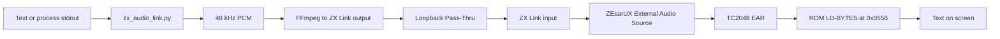
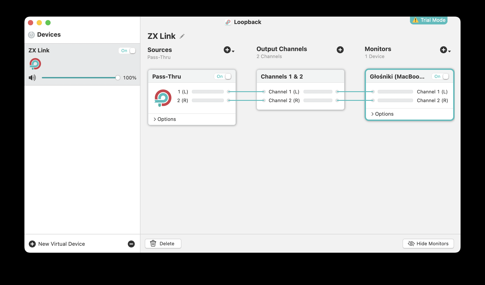
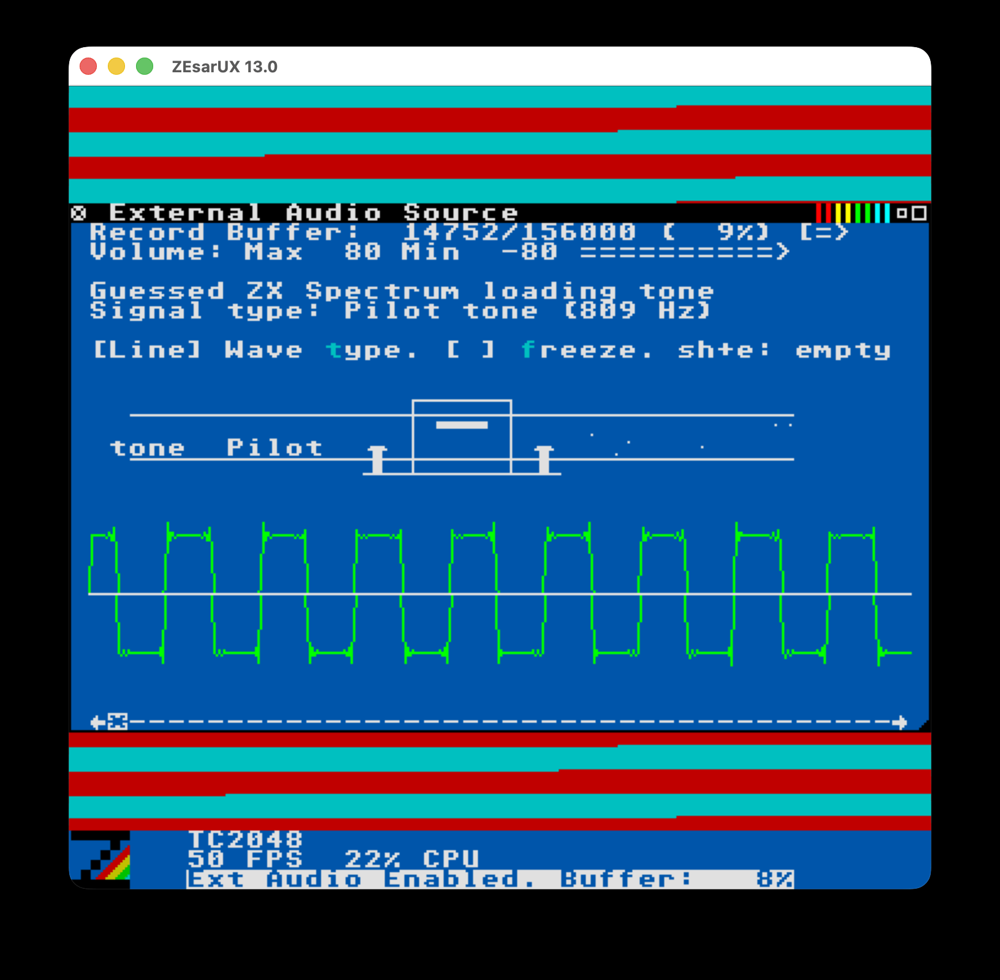
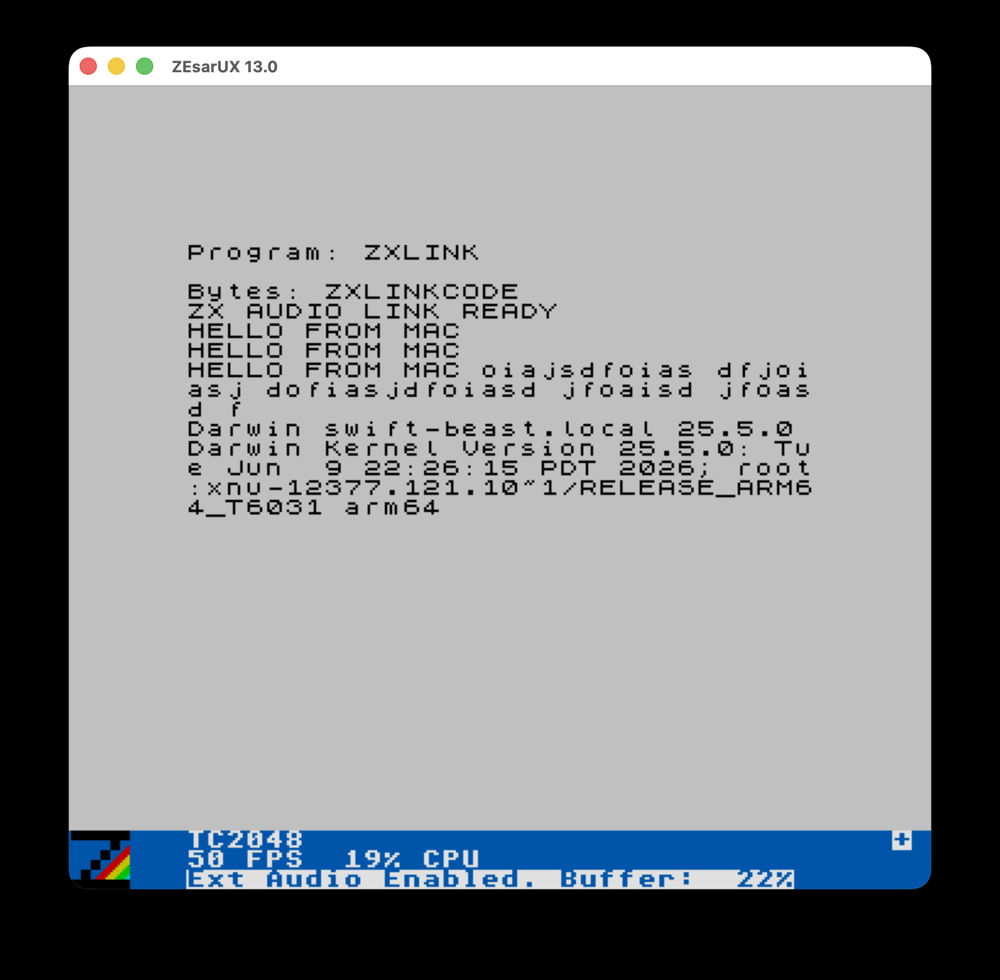

# ZX Audio Link

[](https://github.com/dtz-labs/poc-zx-audio-link/actions/workflows/ci.yml)
[](LICENSE)

**macOS to ZEsarUX to Timex TC2048, over plain audio.**

A proof-of-concept one-way text terminal that sends data from macOS to an
emulated Timex TC2048. The Mac encodes text as standard ZX Spectrum tape
pulses, ZEsarUX feeds the signal into the emulated `EAR` input, and a small
receiver running on the TC2048 decodes and displays the text.

The project does not inject keystrokes, memory, or code through an emulator
API. From the emulated computer's point of view, the data genuinely arrives
through its cassette input.

## Project status

- Direction: **Mac to TC2048**.
- Transport: a CoreAudio virtual device named **ZX Link**, created in Loopback.
- Encoding: the standard ZX Spectrum ROM tape format.
- Receiver: Z80 code loaded at `0x8000`.
- Message size: up to 62 ASCII characters per block; longer text is split
  automatically.
- Full duplex: not implemented yet.
- Timex 2068: not tested; the current launcher starts a TC2048.



## Tested environment

This setup was tested on July 26, 2026 with the following configuration:

| Component | Version or setting |
|---|---|
| macOS | Tahoe 26.5.2, build 25F84 |
| Architecture | Apple Silicon, `arm64` |
| ZEsarUX | 13.0 |
| Emulated machine | Timex Computer 2048 (`TC2048`) |
| Loopback | 2.4.10 |
| FFmpeg | 8.1.2 |
| Python | 3.14.6; the code requires Python 3.9 or later |
| PCM format | signed 16-bit little-endian, 48,000 Hz, mono to stereo |

Loopback 2.4.10 officially supports macOS 26. See Rogue Amoeba's
[compatibility page](https://www.rogueamoeba.com/status/) and
[release notes](https://www.rogueamoeba.com/support/releasenotes/?product=Loopback)
for current information.

## Repository contents

| File | Purpose |
|---|---|
| `zx_audio_link.py` | Generates the receiver TAP, WAV files, and live PCM stream |
| `start-zesarux.sh` | Starts a TC2048 and automatically loads the receiver |
| `send.sh` | Encodes text and sends the audio stream to Loopback |
| `diagnostics/list-audio-devices.sh` | Lists AudioToolbox outputs and AVFoundation inputs |
| `diagnostics/test-virtual-audio.sh` | End-to-end output-to-input test for ZX Link |
| `diagnostics/test-system-output.sh` | Additional test using the macOS system output and `afplay` |
| `diagnostics/test-macbook-microphone.sh` | Verifies permission to record from the physical microphone |
| `diagnostics/make-test-wav.sh` | Creates a WAV file containing a selected message |
| `tests/` | Unit tests for the generator, run with `pytest` |
| `docs/images/` | Screenshots used by this README |

The binary artifacts (`receiver.tap`, `selftest.tap`, `test-message.wav`) are
not tracked in the repository. `start-zesarux.sh` builds the receiver tape
automatically, and section 9 shows how to generate the others.

## 1. Install the dependencies

### Homebrew, FFmpeg, and Python

If Homebrew is not installed, follow the instructions at
[brew.sh](https://brew.sh/). Then run:

```bash
brew install ffmpeg python
```

The scripts first look for FFmpeg at `/opt/homebrew/bin/ffmpeg` and then search
`PATH`, so they can also work on an Intel Mac.

### ZEsarUX 13.0

You can try installing ZEsarUX through Homebrew:

```bash
brew install --cask zesarux
```

Alternatively, download version 13.0 from the
[official ZEsarUX repository](https://github.com/chernandezba/zesarux/releases/tag/ZEsarUX-13.0)
and move `ZEsarUX.app` to `/Applications`.

The launcher expects the application at:

```text
/Applications/ZEsarUX.app
```

Use the `ZESARUX_APP` environment variable if it is installed elsewhere:

```bash
ZESARUX_APP="/another/path/ZEsarUX.app" ./start-zesarux.sh
```

### Loopback 2.4.10

Install Loopback through Homebrew:

```bash
brew install --cask loopback
```

It can also be downloaded directly from the
[Loopback website](https://www.rogueamoeba.com/loopback/).

On first launch:

1. Install the **ARK** component when requested.
2. Grant Loopback/ARK **System Audio Access**.
3. Grant Loopback/ARK microphone access.
4. If macOS asks for Terminal or iTerm microphone access, grant that as well.
   FFmpeg needs this permission when testing an audio input.

The Loopback trial provides all features, but overlays noise after 20 minutes
of active device use. Turning the virtual device off and back on resets the
trial timer. See Rogue Amoeba's
[trial information](https://rogueamoeba.com/support/knowledgebase/?product=Loopback&showArticle=Misc-AboutAppTrials).

## 2. Create the ZX Link device

1. Open Loopback.
2. Click **New Virtual Device**.
3. Rename the device to exactly **ZX Link**.
4. Leave the default **Pass-Thru** source enabled.
5. Keep two output channels with 1-to-1 and 2-to-2 mapping.
6. Do not add a microphone, speakers, or an application as another source.
7. If necessary, set `ZX Link` to `48,000 Hz` in **Audio MIDI Setup**.

This is a known-working Loopback configuration:



The MacBook Speakers entry shown under **Monitors** is optional. It lets you
hear the transmitted signal while testing, but it is not part of the virtual
cable and is not required by ZEsarUX. Keep the monitor disabled during normal
use if you do not want to hear the cassette tones.

A new Loopback device contains `Pass-Thru` by default. This allows it to act as
an output for FFmpeg and, at the same time, an input for ZEsarUX. See the
[Loopback Pass-Thru manual](https://rogueamoeba.com/support/manuals/loopback/?page=passthru)
for details.

In **System Settings > Sound**:

- select `ZX Link` as the input device;
- leave the MacBook speakers selected as the output device.

Do not select `ZX Link` as the normal macOS output during regular use.
`send.sh` addresses the Loopback device directly, so other macOS audio can
continue playing through the speakers.

Device names and System Settings labels may be localized on a non-English
macOS installation.

## 3. Test the virtual cable

If executable permissions were lost while unpacking the archive, restore them
from the repository directory:

```bash
chmod +x ./*.sh ./diagnostics/*.sh
```

List the available devices:

```bash
./diagnostics/list-audio-devices.sh
```

With FFmpeg 8.1.2, a Loopback output may be displayed as `(null)`. This does
not mean the device is missing. It can be identified by a UID similar to:

```text
com.rogueamoeba.Loopback::6D94B290-E225-46E9-AAD1-3AD95212DBF6
```

In the AVFoundation input list, the same device should appear normally as
`ZX Link`.

Run the end-to-end test:

```bash
./diagnostics/test-virtual-audio.sh
```

The script automatically:

1. identifies the single Loopback output by its UID;
2. finds the `ZX Link` input by name;
3. records eight seconds of audio;
4. sends a 1 kHz tone;
5. measures the peak and RMS levels;
6. plays the captured result.

A successful result looks similar to this:

```text
Peak:     2853 (-21.2 dBFS)
RMS:      807 (-32.2 dBFS)
PASS: a clear signal passed through the virtual audio device.
```

If more than one Loopback device exists, specify the device indices manually:

```bash
ZX_AUDIO_DEVICE_INDEX=5 \
ZX_AUDIO_INPUT_INDEX=4 \
./diagnostics/test-virtual-audio.sh "ZX Link"
```

These indices are examples. They may change when audio devices are installed
or removed.

## 4. Start the receiver in ZEsarUX

Run:

```bash
./start-zesarux.sh
```

The launcher:

- generates an up-to-date `receiver.tap`;
- starts a `TC2048` machine;
- automatically loads the BASIC loader and Z80 receiver;
- mutes emulator output to prevent feedback;
- assigns `F1` to the **External Audio Source** window;
- does not save these settings to the global ZEsarUX configuration.

Wait until the emulated screen displays:

```text
ZX AUDIO LINK READY
```

Then:

1. Press `F1`.
2. In the **External Audio Source** window, press uppercase `E` to enable the
   input.
3. If `ZX Link` was selected as the macOS input after ZEsarUX had already
   started, disable and re-enable External Audio Source or restart the
   emulator.

The External Audio Source window should show activity only while a message is
being transmitted.

During a transmission, a known-good External Audio Source window looks like
this:



The important indicators are:

- the bottom status line says `Ext Audio enabled`;
- **Record Buffer** contains data and continues to advance;
- ZEsarUX reports `Guessed ZX Spectrum loading tone`;
- **Signal type** reports a pilot tone at approximately 809 Hz;
- the waveform is strong, regular, and does not collapse into a flat line.

The following screenshot shows the receiver running in ZEsarUX 13.0 with
External Audio enabled. It has successfully received several text messages and
the output of a macOS command through `ZX Link`:



## 5. Send text

Open another Terminal in the same directory and run:

```bash
./send.sh "HELLO FROM MAC"
```

`send.sh` automatically identifies a single Loopback output by its UID. No
manual device index is required when only one Loopback device exists.

For interactive mode, run:

```bash
./send.sh
```

Enter one line at a time and press Return. Press `Ctrl-D` to stop.

Standard output from another process can be piped directly into the link:

```bash
while true; do
    date
    sleep 5
done | ./send.sh
```

Other examples:

```bash
tail -f application.log | ./send.sh
```

```bash
printf 'BUILD OK\n' | ./send.sh
```

A short line takes approximately two or three seconds to transmit. This is a
consequence of using the original robust cassette encoding instead of a faster
custom modem protocol.

If several Loopback devices exist, select the output explicitly:

```bash
export ZX_AUDIO_DEVICE_INDEX=5
./send.sh "HELLO"
```

## 6. Tests without live transmission

### Receiver self-test

Generate `selftest.tap`, which contains the loader, the receiver, and an
initial data block containing `SELF TEST OK`:

```bash
python3 zx_audio_link.py demo "SELF TEST OK" selftest.tap
```

Open it in ZEsarUX as a regular tape and start tape autoload.

If the self-test works but live transmission does not, the Z80 receiver is
working and the problem is in CoreAudio routing or External Audio Source.

### WAV file

Create an audio file containing a selected message:

```bash
./diagnostics/make-test-wav.sh "TEST MESSAGE"
```

This creates `test-message.wav` in the current directory. It can be mounted in
ZEsarUX as **Input Real
Tape**, bypassing Loopback and separating protocol problems from audio-routing
problems.

### Physical microphone test

```bash
./diagnostics/test-macbook-microphone.sh
```

Speak or tap near the MacBook for five seconds. `PASS` confirms that FFmpeg can
record from the audio input.

### System output test

```bash
./diagnostics/test-system-output.sh "ZX Link"
```

The script asks you to select `ZX Link` temporarily as the macOS system output
and uses the native `afplay` utility. Restore the MacBook speakers when the
test finishes.

## 7. Transmission format

The generator uses standard ZX Spectrum pulse timings for a 3.5 MHz clock:

| Element | Length in T-states |
|---|---:|
| Pilot pulse | 2168 |
| Sync pulse 1 | 667 |
| Sync pulse 2 | 735 |
| Bit `0` half-pulse | 855 |
| Bit `1` half-pulse | 1710 |

Each message is sent as a data block with flag `0xFF`, a 64-byte payload, and
the XOR checksum used by the ROM tape format. The receiver:

1. points `IX` at a 64-byte buffer;
2. sets `DE=64`, `A=0xFF`, and the Carry flag;
3. calls the ROM `LD-BYTES` routine at `0x0556`;
4. prints the data through `RST 0x10` after a successful read;
5. waits for the next block.

The payload reserves space for `CR` and a `NUL` terminator, leaving 62
characters for text. Input is encoded as ASCII, with non-ASCII characters
replaced by `?`.

The generated PCM stream is 48 kHz, 16-bit, and mono. FFmpeg duplicates it to
stereo, plays it in real time with `-re`, and appends one second of silence so
that AudioToolbox buffers are flushed before the process exits.

## 8. Troubleshooting

### Loopback is shown as `(null)` in the output list

Check its UID. If it starts with `com.rogueamoeba.Loopback::`, it is the
correct device. The scripts recognize it by UID.

### `test-virtual-audio.sh` reports multiple Loopback devices

Run `./diagnostics/list-audio-devices.sh`, identify the output and input indices belonging
to `ZX Link`, and provide `ZX_AUDIO_DEVICE_INDEX` and `ZX_AUDIO_INPUT_INDEX`
manually.

### Both `Peak` and `RMS` are zero

Check the following:

1. `ZX Link` is enabled in Loopback.
2. The `Pass-Thru` source exists, is enabled, and is set to full volume.
3. Terminal or iTerm has microphone permission.
4. Both sides of the device use a 48 kHz format.
5. The correct indices were selected if several Loopback devices exist.

### The audio test passes, but ZEsarUX receives nothing

1. Select `ZX Link` as the macOS input **before** enabling External Audio
   Source.
2. Press `E` again in the External Audio Source window.
3. Confirm that the receiver displays `ZX AUDIO LINK READY`.
4. Test `selftest.tap` first, then the WAV file, and only then live audio.

### Zsh reports `suspended (tty output)`

Do not run a raw FFmpeg recording command in the background without redirecting
its terminal streams. The supplied scripts use `-nostdin` and redirect the
recorder logs, so they should not trigger this problem.

### Noise appears after some time

This is a Loopback trial limitation. After 20 minutes, turn `ZX Link` off and
back on or purchase a license.

### Why Loopback and not BlackHole

BlackHole 0.6.1 and 0.7.1 did **not** work in the tested environment, no matter
what was tried. The devices were visible to CoreAudio, but every recording made
through them contained only zero-valued samples. Loopback passed the same
end-to-end test on the same machine, which is why this project uses Loopback.
This is an observation from one Mac running macOS 26.5.2 on Apple Silicon, not
a general claim about every BlackHole installation.

## 9. Generate the artifacts

The TAP and WAV artifacts are not tracked in git. Generate them on demand.

Receiver (`start-zesarux.sh` also does this automatically):

```bash
python3 zx_audio_link.py build receiver.tap
```

Self-test:

```bash
python3 zx_audio_link.py demo "SELF TEST OK" selftest.tap
```

WAV file:

```bash
python3 zx_audio_link.py wav "TEST MESSAGE" test-message.wav
```

The generator uses only the Python standard library.

## 10. Development

Run the unit tests:

```bash
python3 -m pytest
```

Install the pre-commit hooks (ruff, shellcheck, and generic hygiene checks):

```bash
pre-commit install
```

## Future work

The next useful development steps are:

1. replace ROM `LD-BYTES` with a faster custom decoder;
2. add frames with sequence numbers, length fields, and CRC;
3. add ACK/NAK responses;
4. create a second independent Loopback channel for TC2048 to Mac traffic;
5. implement full duplex with collision control or separate channels.

## License

This project is licensed under the [MIT License](LICENSE).
